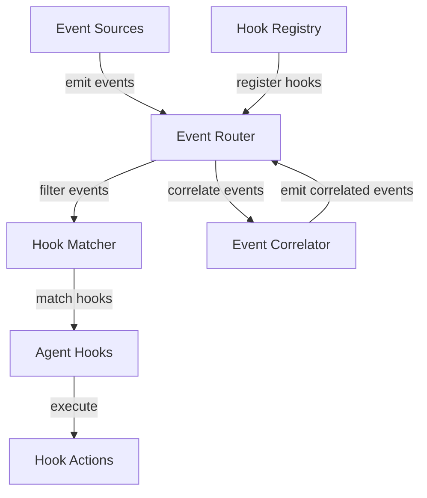

# Design Document: Agent Hooks Refactoring

## Overview

This design document outlines the approach for migrating existing hooks from `src/agent_hooks/hooks` to the new architecture in `.kiro/engine`. The migration will standardize hook implementation, improve event routing, and enhance the overall reliability and maintainability of the agent hooks system.

The new architecture provides a more robust framework for event handling, filtering, and correlation, allowing for more sophisticated automation scenarios. This document details the technical design decisions, architecture, and implementation strategy for this refactoring effort.

## Architecture

The refactored agent hooks system follows a modular, event-driven architecture with clear separation of concerns:



### Key Components

1. **Event Router**: Central component that receives events and routes them to matching hooks
2. **Hook Matcher**: Determines which hooks should be triggered for a given event
3. **Event Correlator**: Identifies patterns across multiple events and generates higher-level events
4. **Agent Hooks**: Individual hook implementations that inherit from the `AgentHook` base class
5. **Hook Registry**: Manages hook registration and configuration

## Components and Interfaces

### Event Models

The event system uses a consistent model structure:

```python
class BaseEvent:
    id: str
    source: str
    type: EventType
    timestamp: datetime
    correlation_id: Optional[str]
    data: Dict[str, Any]
```

### Hook Base Class

All hooks will inherit from the `AgentHook` abstract base class:

```python
class AgentHook(ABC):
    @abstractmethod
    async def should_execute(self, context: HookContext) -> bool:
        pass
    
    @abstractmethod
    async def execute(self, context: HookContext) -> HookResult:
        pass
    
    @abstractmethod
    def get_resource_requirements(self) -> Dict[str, Any]:
        pass
```

### Event Filtering

Events are filtered using the `EventFilterGroup` class, which supports complex filtering conditions:

```python
class EventFilter:
    field: str
    operator: FilterOperator
    value: Any

class EventFilterGroup:
    filters: List[EventFilter]
    operator: LogicalOperator
    nested_groups: List[EventFilterGroup]
```

### Hook Context

Hooks receive a context object containing all relevant information:

```python
class HookContext:
    trigger_event: Dict[str, Any]
    project_state: Dict[str, Any]
    system_metrics: Dict[str, Any]
    user_preferences: Dict[str, Any]
    execution_history: List[Dict[str, Any]]
    execution_id: str
    timestamp: datetime
```

## Data Models

### Event Types

```python
class EventType(Enum):
    FILE_SAVE = "file_save"
    FILE_MODIFY = "file_modify"
    FILE_CREATE = "file_create"
    FILE_RENAME = "file_rename"
    SERVICE_HEALTH = "service_health"
    RESOURCE_USAGE = "resource_usage"
    CUSTOM = "custom"
```

### Hook Priority

```python
class HookPriority(Enum):
    CRITICAL = 1
    HIGH = 2
    MEDIUM = 3
    LOW = 4
```

### Hook Result

```python
class HookResult:
    success: bool
    message: str
    actions_taken: List[str]
    suggestions: List[str]
    metrics: Dict[str, Any]
    artifacts: List[str]
    execution_time_ms: Optional[float]
    error: Optional[Exception]
```

## Migration Strategy

### Hook Migration Process

For each hook in `src/agent_hooks/hooks`, we will:

1. Create a new class in `.kiro/hooks` that inherits from `AgentHook`
2. Map the original hook's trigger conditions to the new `HookTrigger` model
3. Implement the required abstract methods: `should_execute`, `execute`, and `get_resource_requirements`
4. Migrate internal state management and logic
5. Add appropriate error handling and logging
6. Create unit and integration tests

### Example Migration: AutomatedTestRunnerHook

Original hook:
```python
# src/agent_hooks/hooks/automated_test_runner_hook.py
class AutomatedTestRunnerHook:
    def __init__(self, file_patterns, exclude_patterns):
        self.file_patterns = file_patterns
        self.exclude_patterns = exclude_patterns
        self.last_run = {}
```

Migrated hook:
```python
# .kiro/hooks/automated_test_runner_hook.py
class AutomatedTestRunnerHook(AgentHook):
    def __init__(self, config: Dict[str, Any]):
        super().__init__(config)
        self.file_patterns = config.get("file_patterns", ["*.py"])
        self.exclude_patterns = config.get("exclude_patterns", ["__pycache__/*"])
        self.last_run = {}
    
    async def should_execute(self, context: HookContext) -> bool:
        # Implementation
        pass
    
    async def execute(self, context: HookContext) -> HookResult:
        # Implementation
        pass
    
    def get_resource_requirements(self) -> Dict[str, Any]:
        return {"cpu": "low", "memory": "low"}
```

## Error Handling

The refactored system will implement a comprehensive error handling strategy:

1. **Hook-level error handling**: Each hook will catch and handle its own exceptions
2. **Router-level error handling**: The router will catch exceptions from hooks and continue execution
3. **Logging**: All errors will be logged with appropriate context
4. **Retry mechanism**: Critical hooks can implement retry logic for transient failures

## Testing Strategy

### Unit Testing

Each migrated hook will have unit tests that:

1. Verify the hook's trigger conditions
2. Test the `should_execute` logic with various contexts
3. Test the `execute` method with mocked dependencies
4. Verify error handling behavior

### Integration Testing

Integration tests will verify:

1. Event routing to appropriate hooks
2. Hook execution in the correct priority order
3. Event correlation functionality
4. End-to-end scenarios for common use cases

### Test Data

We will create a set of test fixtures that represent:

1. Various event types and data
2. Hook configurations
3. Project states and contexts

## Implementation Plan

The implementation will follow these phases:

1. **Setup**: Create the necessary directory structure and base classes
2. **Migration**: Migrate each hook one by one, starting with the simplest
3. **Testing**: Implement tests for each migrated hook
4. **Integration**: Update the event router to use the new hooks
5. **Documentation**: Update documentation and add usage examples
6. **Cleanup**: Remove the old hook implementations once migration is complete

## Design Decisions and Rationales

### Async Implementation

The new architecture uses async/await throughout to support non-blocking I/O operations. This allows hooks to perform network requests, file operations, and other I/O without blocking the main thread.

### Event Correlation

The event correlation system allows for identifying patterns across multiple events and generating higher-level events. This enables more sophisticated automation scenarios, such as detecting a sequence of related events and taking appropriate action.

### Priority-based Execution

Hooks are executed in priority order to ensure that critical hooks run first. This allows for implementing security-related hooks that must run before other hooks.

### Configurable Filtering

The `EventFilterGroup` class provides a flexible way to define complex filtering conditions. This allows hooks to be triggered only for specific events that match certain criteria.

### State Management

Hooks can maintain internal state between executions, allowing for implementing debounce logic, cooldown periods, and other stateful behaviors.

## Potential Challenges and Mitigations

### Backward Compatibility

**Challenge**: Ensuring that migrated hooks maintain the same behavior as the original hooks.

**Mitigation**: Comprehensive testing and careful mapping of trigger conditions and configuration options.

### Performance

**Challenge**: The new architecture introduces additional overhead for event routing and filtering.

**Mitigation**: Optimize the matcher and router implementations, and consider adding caching for frequently accessed data.

### Concurrency

**Challenge**: Multiple hooks executing concurrently could lead to race conditions or resource contention.

**Mitigation**: Implement proper synchronization mechanisms and consider adding a resource manager to limit concurrent executions.

### Testing Complexity

**Challenge**: Testing event-driven systems can be complex due to asynchronous behavior and state management.

**Mitigation**: Use appropriate testing frameworks and patterns, such as mock objects and controlled environments.