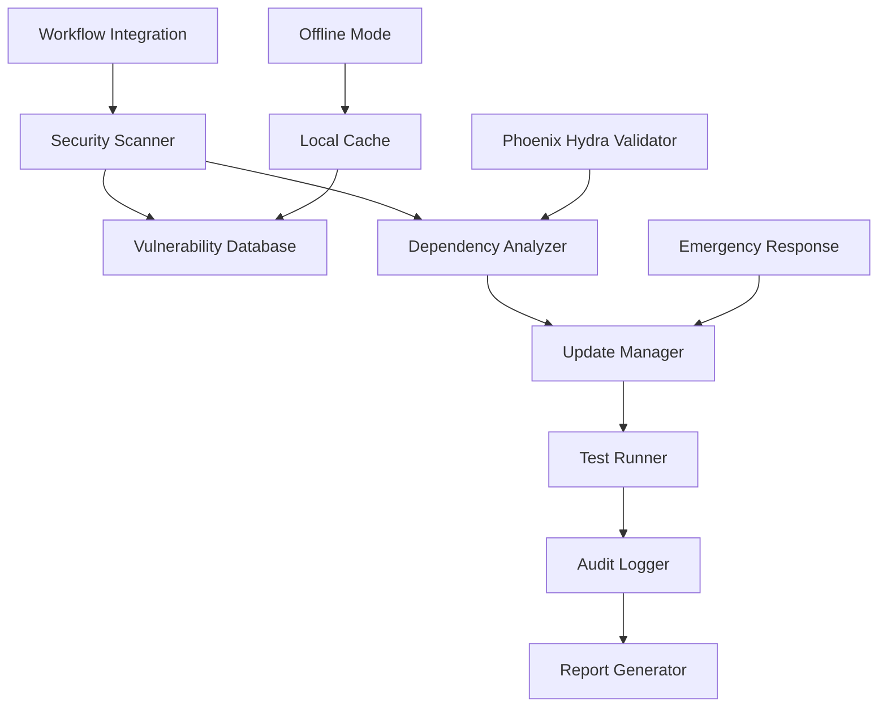

# Dependency Security Management Design

## Overview

This design implements a comprehensive dependency security management system for Phoenix Hydra that automates vulnerability detection, manages updates safely, and maintains audit trails while respecting Phoenix Hydra's offline-first and privacy-focused architecture.

## Architecture

### Core Components



### Component Responsibilities

#### Security Scanner
- Performs automated vulnerability scans using multiple sources
- Integrates with npm audit, Snyk, and OWASP dependency check
- Maintains local vulnerability database for offline operation
- Prioritizes vulnerabilities based on Phoenix Hydra impact assessment

#### Dependency Analyzer
- Analyzes dependency trees for conflicts and compatibility
- Validates dependencies against Phoenix Hydra requirements
- Checks for offline compatibility and privacy compliance
- Generates impact reports for proposed changes

#### Update Manager
- Manages automated and manual dependency updates
- Implements staged rollout with testing at each phase
- Handles emergency security patches with fast-track procedures
- Maintains rollback capabilities for failed updates

#### Phoenix Hydra Validator
- Ensures dependencies support offline-first operation
- Validates privacy compliance (no telemetry/tracking)
- Checks compatibility with rootless containers
- Verifies alignment with Phoenix Hydra's security principles

## Data Models

### Vulnerability Record
```typescript
interface VulnerabilityRecord {
  id: string;
  packageName: string;
  version: string;
  severity: 'critical' | 'high' | 'moderate' | 'low';
  cve: string;
  description: string;
  phoenixHydraImpact: 'blocking' | 'warning' | 'info';
  remediation: RemediationStep[];
  detectedAt: Date;
  resolvedAt?: Date;
  status: 'open' | 'resolved' | 'mitigated' | 'accepted';
}
```

### Dependency Update
```typescript
interface DependencyUpdate {
  id: string;
  packageName: string;
  fromVersion: string;
  toVersion: string;
  updateType: 'patch' | 'minor' | 'major' | 'security';
  phoenixHydraCompatible: boolean;
  testResults: TestResult[];
  approvalRequired: boolean;
  appliedAt?: Date;
  rollbackPlan: RollbackStep[];
}
```

### Security Audit Entry
```typescript
interface SecurityAuditEntry {
  id: string;
  timestamp: Date;
  action: 'scan' | 'update' | 'resolve' | 'mitigate';
  packageName: string;
  details: string;
  developer: string;
  phoenixHydraImpact: string;
  verificationSteps: string[];
}
```

## Implementation Strategy

### Phase 1: Core Security Infrastructure

#### Local Vulnerability Database
```bash
# Create local vulnerability cache
mkdir -p .phoenix-hydra/security/
npm audit --json > .phoenix-hydra/security/audit-$(date +%Y%m%d).json

# Sync with multiple vulnerability sources
curl -s https://api.osv.dev/v1/query | jq '.' > .phoenix-hydra/security/osv-db.json
```

#### Security Scanner Implementation
```javascript
// scripts/security-scanner.js
class PhoenixHydraSecurityScanner {
  async scanDependencies() {
    const auditResult = await this.runNpmAudit();
    const osvResult = await this.queryOSVDatabase();
    const phoenixHydraAssessment = await this.assessPhoenixHydraImpact(auditResult);
    
    return this.generateSecurityReport({
      npm: auditResult,
      osv: osvResult,
      phoenixHydra: phoenixHydraAssessment
    });
  }
  
  async assessPhoenixHydraImpact(vulnerabilities) {
    return vulnerabilities.map(vuln => ({
      ...vuln,
      phoenixHydraImpact: this.calculatePhoenixHydraImpact(vuln),
      offlineCompatible: this.checkOfflineCompatibility(vuln.package),
      privacyCompliant: this.checkPrivacyCompliance(vuln.package)
    }));
  }
}
```

### Phase 2: Automated Update Management

#### Update Manager
```javascript
// scripts/update-manager.js
class PhoenixHydraUpdateManager {
  async processSecurityUpdates() {
    const vulnerabilities = await this.scanner.scanDependencies();
    const criticalUpdates = vulnerabilities.filter(v => v.severity === 'critical');
    
    for (const update of criticalUpdates) {
      if (update.phoenixHydraImpact === 'blocking') {
        await this.emergencyUpdate(update);
      } else {
        await this.scheduledUpdate(update);
      }
    }
  }
  
  async emergencyUpdate(update) {
    // Fast-track critical security updates
    const backupState = await this.createBackup();
    try {
      await this.applyUpdate(update);
      await this.runCriticalTests();
      await this.logAuditEntry(update, 'emergency_applied');
    } catch (error) {
      await this.rollback(backupState);
      await this.notifyEmergencyFailure(update, error);
    }
  }
}
```

### Phase 3: Phoenix Hydra Integration

#### Dependency Validator
```javascript
// scripts/phoenix-hydra-validator.js
class PhoenixHydraValidator {
  async validateDependency(packageName, version) {
    const checks = await Promise.all([
      this.checkOfflineCompatibility(packageName, version),
      this.checkPrivacyCompliance(packageName, version),
      this.checkContainerCompatibility(packageName, version),
      this.checkSecurityPosture(packageName, version)
    ]);
    
    return {
      packageName,
      version,
      phoenixHydraCompliant: checks.every(check => check.passed),
      checks,
      recommendations: this.generateRecommendations(checks)
    };
  }
  
  async checkOfflineCompatibility(packageName, version) {
    // Check if package works without internet connectivity
    const packageInfo = await this.getPackageInfo(packageName, version);
    const hasExternalDependencies = this.analyzeExternalDependencies(packageInfo);
    
    return {
      name: 'offline_compatibility',
      passed: !hasExternalDependencies,
      details: hasExternalDependencies ? 
        'Package requires external network access' : 
        'Package supports offline operation'
    };
  }
}
```

### Phase 4: Workflow Integration

#### VS Code Tasks Integration
```json
// .vscode/tasks.json additions
{
  "label": "Phoenix Security Scan",
  "type": "shell",
  "command": "node",
  "args": ["scripts/security-scanner.js"],
  "group": "build",
  "presentation": {
    "echo": true,
    "reveal": "always",
    "focus": false,
    "panel": "shared"
  },
  "problemMatcher": {
    "pattern": {
      "regexp": "^(WARNING|ERROR):\\s+(.*)\\s+in\\s+(.*)$",
      "severity": 1,
      "message": 2,
      "file": 3
    }
  }
}
```

#### Git Hooks Integration
```bash
#!/bin/sh
# .git/hooks/pre-commit
echo "Running Phoenix Hydra security scan..."
node scripts/security-scanner.js --pre-commit

if [ $? -ne 0 ]; then
  echo "Security scan failed. Commit blocked."
  echo "Run 'npm run security:fix' to resolve issues."
  exit 1
fi
```

## Error Handling

### Vulnerability Resolution Strategies

#### Strategy 1: Automated Patching
```javascript
async resolveVulnerability(vulnerability) {
  const strategies = [
    () => this.tryAutomaticUpdate(vulnerability),
    () => this.tryAlternativePackage(vulnerability),
    () => this.tryVersionPinning(vulnerability),
    () => this.tryManualMitigation(vulnerability)
  ];
  
  for (const strategy of strategies) {
    try {
      const result = await strategy();
      if (result.success) {
        await this.logResolution(vulnerability, result);
        return result;
      }
    } catch (error) {
      console.warn(`Strategy failed: ${error.message}`);
    }
  }
  
  throw new Error(`Unable to resolve vulnerability: ${vulnerability.id}`);
}
```

#### Strategy 2: Emergency Response
```javascript
async handleEmergencyVulnerability(vulnerability) {
  // Immediate containment
  await this.disableAffectedFeatures(vulnerability);
  
  // Rapid assessment
  const impact = await this.assessProductionImpact(vulnerability);
  
  // Emergency patching
  if (impact.critical) {
    await this.emergencyPatch(vulnerability);
  } else {
    await this.scheduleMaintenance(vulnerability);
  }
  
  // Notification
  await this.notifyStakeholders(vulnerability, impact);
}
```

## Testing Strategy

### Security Test Suite
```javascript
// tests/security/dependency-security.test.js
describe('Dependency Security Management', () => {
  test('should detect known vulnerabilities', async () => {
    const scanner = new PhoenixHydraSecurityScanner();
    const results = await scanner.scanDependencies();
    
    expect(results.vulnerabilities).toBeDefined();
    expect(results.phoenixHydraAssessment).toBeDefined();
  });
  
  test('should validate Phoenix Hydra compatibility', async () => {
    const validator = new PhoenixHydraValidator();
    const result = await validator.validateDependency('react-syntax-highlighter', '15.6.1');
    
    expect(result.phoenixHydraCompliant).toBe(true);
    expect(result.checks.find(c => c.name === 'offline_compatibility').passed).toBe(true);
  });
  
  test('should handle emergency updates', async () => {
    const updateManager = new PhoenixHydraUpdateManager();
    const mockVulnerability = createMockCriticalVulnerability();
    
    await updateManager.emergencyUpdate(mockVulnerability);
    
    expect(mockVulnerability.status).toBe('resolved');
  });
});
```

### Integration Tests
```javascript
// tests/integration/security-workflow.test.js
describe('Security Workflow Integration', () => {
  test('should integrate with VS Code tasks', async () => {
    const taskRunner = new VSCodeTaskRunner();
    const result = await taskRunner.run('Phoenix Security Scan');
    
    expect(result.exitCode).toBe(0);
    expect(result.output).toContain('Security scan completed');
  });
  
  test('should block commits with critical vulnerabilities', async () => {
    const gitHook = new GitPreCommitHook();
    const mockCriticalVuln = createMockCriticalVulnerability();
    
    jest.spyOn(scanner, 'scanDependencies').mockResolvedValue([mockCriticalVuln]);
    
    const result = await gitHook.execute();
    expect(result.allowed).toBe(false);
  });
});
```

## Monitoring and Observability

### Security Metrics
```javascript
// scripts/security-metrics.js
class SecurityMetrics {
  async generateMetrics() {
    return {
      vulnerabilityTrends: await this.getVulnerabilityTrends(),
      resolutionTimes: await this.getResolutionTimes(),
      phoenixHydraCompliance: await this.getComplianceMetrics(),
      emergencyResponseTimes: await this.getEmergencyMetrics()
    };
  }
  
  async getVulnerabilityTrends() {
    const last30Days = await this.getAuditEntries(30);
    return {
      newVulnerabilities: last30Days.filter(e => e.action === 'scan').length,
      resolvedVulnerabilities: last30Days.filter(e => e.action === 'resolve').length,
      averageResolutionTime: this.calculateAverageResolutionTime(last30Days)
    };
  }
}
```

### Reporting Dashboard
```javascript
// scripts/security-dashboard.js
class SecurityDashboard {
  async generateReport() {
    const template = await this.loadReportTemplate();
    const data = {
      currentSecurityPosture: await this.getCurrentSecurityPosture(),
      recentUpdates: await this.getRecentUpdates(),
      phoenixHydraCompliance: await this.getComplianceStatus(),
      recommendations: await this.getRecommendations()
    };
    
    return this.renderReport(template, data);
  }
}
```

This design provides a comprehensive approach to managing dependency security in Phoenix Hydra while maintaining the system's core principles of offline operation, privacy, and security.