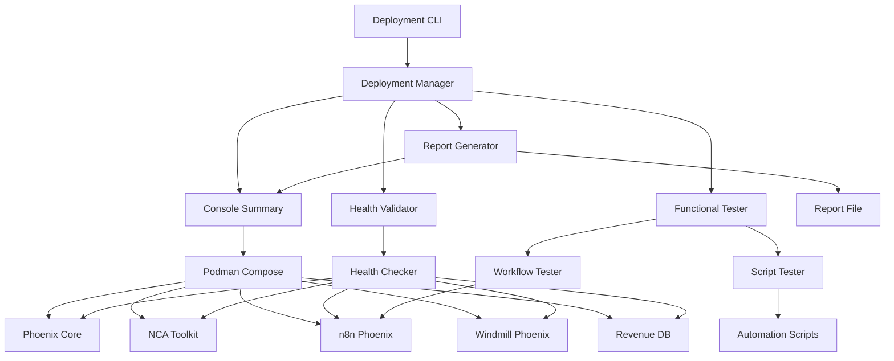

# Design Document

## Overview

The Phoenix Hydra Deployment Validation system is a comprehensive automated testing and validation framework that ensures the entire Phoenix Hydra stack deploys correctly and functions as intended. The system follows a multi-phase approach: deployment, health validation, functional testing, and reporting. It leverages the existing Podman-based infrastructure and integrates with the current automation scripts to provide end-to-end system validation.

## Architecture

### High-Level Architecture



### Component Architecture

The system is organized into distinct modules following the Phoenix Hydra project structure:

- **Core Module** (`src/deployment_validation/core/`): Central orchestration and configuration
- **Services Module** (`src/deployment_validation/services/`): Container management and health checking
- **Testing Module** (`src/deployment_validation/testing/`): Functional and integration testing
- **Reporting Module** (`src/deployment_validation/reporting/`): Report generation and metrics
- **Utils Module** (`src/deployment_validation/utils/`): Shared utilities and helpers

## Components and Interfaces

### 1. Deployment Manager

**Purpose**: Central orchestrator that manages the entire validation process

**Interface**:

```python
class DeploymentManager:
    async def deploy_and_validate(self, config: DeploymentConfig) -> ValidationResult
    async def cleanup_deployment(self, deployment_id: str) -> CleanupResult
    async def rollback_deployment(self, deployment_id: str) -> RollbackResult
```

**Key Responsibilities**:

- Coordinate deployment phases
- Manage deployment lifecycle
- Handle error recovery and rollback with up to 3 retry attempts
- Generate deployment IDs for tracking
- Implement automatic cleanup on deployment failure

### 2. Container Service

**Purpose**: Manages Podman container operations and monitoring

**Interface**:

```python
class ContainerService:
    async def deploy_stack(self, compose_file: str) -> DeploymentResult
    async def get_container_status(self, container_name: str) -> ContainerStatus
    async def restart_container(self, container_name: str) -> RestartResult
    async def cleanup_containers(self, deployment_id: str) -> CleanupResult
```

**Key Responsibilities**:

- Execute podman-compose commands
- Monitor container lifecycle
- Collect container metrics
- Handle container cleanup

### 3. Health Validator

**Purpose**: Performs comprehensive health checks on all services

**Interface**:

```python
class HealthValidator:
    async def validate_all_services(self) -> HealthReport
    async def validate_service(self, service: ServiceConfig) -> ServiceHealth
    async def wait_for_healthy(self, service: ServiceConfig, timeout: int) -> bool
```

**Service Configurations**:

- **Phoenix Core**: HTTP GET to `http://localhost:8080/health`
- **NCA Toolkit**: HTTP GET to `http://localhost:8081/`
- **n8n Phoenix**: HTTP GET to `http://localhost:5678/healthz`
- **Windmill Phoenix**: HTTP GET to `http://localhost:8000/api/version`
- **Revenue DB**: PostgreSQL connection test

**Retry Strategy**:

- Up to 5 retry attempts with exponential backoff for failed health checks
- Initial retry delay: 1 second, maximum delay: 30 seconds
- Health check timeout: 30 seconds per attempt

### 4. Functional Tester

**Purpose**: Executes end-to-end functional tests to validate system capabilities

**Interface**:

```python
class FunctionalTester:
    async def run_all_tests(self) -> FunctionalTestReport
    async def test_n8n_workflows(self) -> TestResult
    async def test_windmill_scripts(self) -> TestResult
    async def test_automation_scripts(self) -> TestResult
```

**Test Scenarios**:

- **n8n Workflow Test**: Create and execute a simple workflow
- **Windmill Script Test**: Execute a basic GitOps operation
- **Revenue Tracking Test**: Run `node scripts/revenue-tracking.js`
- **Badge Deployment Test**: Run `node scripts/deploy-badges.js`
- **NEOTEC Generation Test**: Run `python scripts/neotec-generator.py`

### 5. Security Validator

**Purpose**: Validates security configurations and compliance with security best practices

**Interface**:

```python
class SecurityValidator:
    async def validate_all_security(self) -> SecurityReport
    async def validate_container_security(self) -> ContainerSecurityResult
    async def validate_network_security(self) -> NetworkSecurityResult
    async def validate_ssl_configurations(self) -> SSLValidationResult
```

**Security Validations**:

- **Rootless Container Check**: Verify all containers run without root privileges
- **User Permission Validation**: Ensure containers use appropriate user permissions
- **Network Isolation**: Validate service communication through defined networks only
- **Port Exposure Check**: Identify and validate exposed sensitive ports
- **SSL/TLS Configuration**: Verify SSL/TLS configurations where applicable
- **Resource Limits**: Ensure CPU and memory constraints prevent resource exhaustion

### 6. Report Generator

**Purpose**: Creates comprehensive deployment and validation reports

**Interface**:

```python
class ReportGenerator:
    async def generate_report(self, results: ValidationResults) -> DeploymentReport
    async def save_report(self, report: DeploymentReport, path: str) -> bool
    async def display_summary(self, report: DeploymentReport) -> None
```

**Report Structure**:

```json
{
  "deployment_id": "deploy_20250123_143022",
  "timestamp": "2025-01-23T14:30:22Z",
  "duration_seconds": 127,
  "status": "SUCCESS",
  "services": {
    "phoenix-core": {
      "status": "healthy",
      "response_time_ms": 45,
      "health_check_url": "http://localhost:8080/health"
    }
  },
  "functional_tests": {
    "n8n_workflow": {"status": "passed", "duration_ms": 2340},
    "revenue_tracking": {"status": "passed", "duration_ms": 1250}
  },
  "container_metrics": {
    "total_containers": 5,
    "running_containers": 5,
    "resource_usage": {...}
  },
  "security_validation": {
    "rootless_containers": true,
    "network_isolation": true,
    "exposed_ports": [8080, 8081, 5678, 8000]
  }
}
```

## Data Models

### Core Data Structures

```python
@dataclass
class DeploymentConfig:
    compose_file: str = "infra/podman/compose.yaml"
    timeout_seconds: int = 300
    retry_attempts: int = 3
    cleanup_on_failure: bool = True
    security_validation: bool = True

@dataclass
class ServiceConfig:
    name: str
    health_check_url: str
    expected_status_code: int = 200
    timeout_seconds: int = 30
    retry_attempts: int = 5

@dataclass
class ValidationResult:
    deployment_id: str
    status: ValidationStatus
    deployment_result: DeploymentResult
    health_results: List[ServiceHealth]
    functional_results: List[TestResult]
    security_results: SecurityValidation
    duration_seconds: float
    errors: List[ValidationError]

@dataclass
class ContainerStatus:
    container_id: str
    name: str
    status: str
    cpu_percent: float
    memory_percent: float
    network_ports: List[PortMapping]
    health_status: str
```

### Configuration Management

The system uses a hierarchical configuration approach:

1. **Default Configuration**: Built-in defaults for all services
2. **Environment Configuration**: Environment-specific overrides
3. **Runtime Configuration**: Command-line and runtime parameters

Configuration files are stored in `configs/deployment-validation/`:

- `services.yaml`: Service definitions and health check configurations
- `tests.yaml`: Functional test definitions and parameters
- `security.yaml`: Security validation rules and thresholds

## Error Handling

### Error Categories

1. **Deployment Errors**: Container startup failures, network issues
2. **Health Check Errors**: Service unavailability, timeout errors
3. **Functional Test Errors**: Workflow failures, script execution errors
4. **System Errors**: Resource constraints, permission issues

### Error Recovery Strategy

```python
class ErrorRecoveryStrategy:
    async def handle_deployment_error(self, error: DeploymentError) -> RecoveryAction
    async def handle_health_check_error(self, error: HealthCheckError) -> RecoveryAction
    async def handle_test_error(self, error: TestError) -> RecoveryAction
```

**Recovery Actions**:

- **Retry**: Exponential backoff retry with configurable limits
- **Restart**: Container restart for transient issues
- **Rollback**: Full deployment rollback for critical failures
- **Continue**: Skip non-critical failures and continue validation
- **Abort**: Stop validation and cleanup for fatal errors

**Cleanup and Rollback Behaviors**:

- **Automatic Cleanup**: When deployment fails, automatically stop all started containers
- **Network Cleanup**: Remove any created networks and volumes during cleanup
- **Log Preservation**: Preserve logs and error information for debugging during cleanup
- **Configuration Restoration**: Restore previous working configuration during rollback
- **Manual Cleanup Instructions**: Provide manual cleanup instructions if automatic cleanup fails
- **State Reporting**: Report final system state after cleanup completion

### Logging and Monitoring

All components use structured logging with the following levels:

- **DEBUG**: Detailed execution flow and variable states
- **INFO**: Major operation status and progress updates
- **WARN**: Non-critical issues and recovery actions
- **ERROR**: Failures requiring attention or intervention

Log format:

```json
{
  "timestamp": "2025-01-23T14:30:22Z",
  "level": "INFO",
  "component": "health_validator",
  "deployment_id": "deploy_20250123_143022",
  "message": "Service phoenix-core health check passed",
  "metadata": {
    "service": "phoenix-core",
    "response_time_ms": 45,
    "status_code": 200
  }
}
```

## Testing Strategy

### Unit Testing

Each component has comprehensive unit tests covering:

- Normal operation scenarios
- Error conditions and edge cases
- Configuration validation
- Mock external dependencies

Test structure:

```
tests/unit/deployment_validation/
├── test_deployment_manager.py
├── test_container_service.py
├── test_health_validator.py
├── test_functional_tester.py
└── test_report_generator.py
```

### Integration Testing

Integration tests validate component interactions:

- Container service with actual Podman commands
- Health validator with running services
- Functional tester with live workflows
- End-to-end deployment scenarios

### Chaos Testing

Chaos tests simulate failure scenarios:

- Container crashes during deployment
- Network connectivity issues
- Resource exhaustion conditions
- Service dependency failures

### Performance Testing

Performance tests ensure scalability:

- Deployment time under various loads
- Health check response times
- Memory and CPU usage patterns
- Concurrent deployment handling

## Security Considerations

### Container Security

- **Rootless Execution**: All containers run without root privileges
- **Network Isolation**: Services communicate through defined networks only
- **Resource Limits**: CPU and memory constraints prevent resource exhaustion
- **Image Scanning**: Container images are scanned for vulnerabilities

### Data Protection

- **Credential Management**: Database passwords and API keys stored securely
- **Log Sanitization**: Sensitive information filtered from logs
- **Report Security**: Deployment reports exclude sensitive configuration data

### Access Control

- **Service Authentication**: Internal service communication uses authentication
- **API Security**: External APIs require proper authentication tokens
- **File Permissions**: Configuration files have restricted access permissions

## Performance Optimization

### Parallel Execution

- Health checks run concurrently for all services
- Functional tests execute in parallel where possible
- Container operations use async/await patterns

### Caching Strategy

- Container status cached to reduce Podman API calls
- Health check results cached with TTL
- Configuration files cached in memory

### Resource Management

- Connection pooling for database and HTTP clients
- Graceful shutdown handling for all components
- Memory usage monitoring and cleanup

## Deployment and Operations

### CLI Interface

```bash
# Full deployment validation
python -m deployment_validation deploy --config configs/deployment-validation/production.yaml

# Health checks only
python -m deployment_validation health-check --services phoenix-core,nca-toolkit

# Functional tests only
python -m deployment_validation test --test-suite automation-scripts

# Generate report from previous run
python -m deployment_validation report --deployment-id deploy_20250123_143022
```

### VS Code Integration

New VS Code tasks added to `.vscode/tasks.json`:

- **Phoenix: Full Deployment Validation**
- **Phoenix: Health Check All Services**
- **Phoenix: Run Functional Tests**
- **Phoenix: Generate Deployment Report**

### Monitoring Integration

The system integrates with existing Phoenix Hydra monitoring:

- Metrics exported to Prometheus
- Grafana dashboards for deployment tracking
- Alert rules for deployment failures
- Integration with existing observability stack

### Continuous Integration

GitHub Actions workflow for automated validation:

- Triggered on pull requests to main branch
- Runs full deployment validation in CI environment
- Reports results as PR status checks
- Stores deployment reports as artifacts