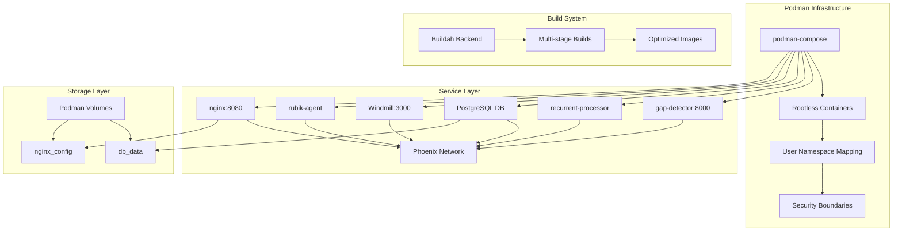

# Design Document

## Overview

The Docker-to-Podman migration design provides a comprehensive approach to converting the existing Phoenix Hydra container infrastructure from Docker to Podman. This migration ensures rootless execution, improved security, and alignment with Phoenix Hydra's architectural principles while maintaining all existing functionality. The design addresses container definitions, networking, volume management, and deployment automation to create a seamless transition to Podman-based infrastructure.

## Architecture

### Current Architecture Analysis

The existing system consists of:
- **7 services**: gap-detector, recurrent-processor, db (PostgreSQL), windmill, rubik-agent, nginx, and analysis-engine (commented)
- **Custom Dockerfiles**: 5 custom container definitions with Python and nginx services
- **Shared networking**: All services communicate via `phoenix-net` network
- **Volume persistence**: PostgreSQL data persistence via `db_data` volume
- **Port exposure**: External access via ports 8000, 3000, and 8080

### Target Podman Architecture



## Components and Interfaces

### 1. Podman Compose Configuration (`podman-compose.yaml`)

The main orchestration file that replaces `compose.yaml` with Podman-specific optimizations.

**Key Changes:**
- Version compatibility with podman-compose
- Rootless-friendly volume definitions
- Podman network configuration
- Security context specifications

**Structure:**
```yaml
version: '3.8'
services:
  gap-detector:
    build:
      context: .
      dockerfile: infra/podman/gap-detector/Containerfile
    ports:
      - "8000:8000"
    environment:
      - APP_ENV=development
    depends_on:
      - recurrent-processor
    networks:
      - phoenix-net
    security_opt:
      - no-new-privileges:true
    user: "1000:1000"
```

### 2. Containerfile Conversions

Convert all Dockerfiles to Containerfiles with Podman optimizations.

#### Gap Detector Containerfile (`infra/podman/gap-detector/Containerfile`)
```dockerfile
FROM python:3.11-slim

# Create non-root user
RUN groupadd -r appuser && useradd -r -g appuser appuser

WORKDIR /app

# Copy requirements first for better caching
COPY requirements-gap-detector.txt .
RUN pip install --no-cache-dir --user -r requirements-gap-detector.txt

# Copy application code
COPY src/core/gap_detection_system.py .

# Switch to non-root user
USER appuser

CMD ["python", "gap_detection_system.py"]
```

#### Recurrent Processor Containerfile (`infra/podman/recurrent-processor/Containerfile`)
```dockerfile
FROM python:3.10-slim

RUN groupadd -r appuser && useradd -r -g appuser appuser

WORKDIR /app

COPY requirements-recurrent.txt .
RUN pip install --no-cache-dir --user -r requirements-recurrent.txt

COPY src/core/recurrent_processor.py .

USER appuser

CMD ["python", "recurrent_processor.py"]
```

### 3. Network Configuration

Podman networking with proper DNS resolution and security isolation.

**Network Definition:**
```yaml
networks:
  phoenix-net:
    driver: bridge
    driver_opts:
      com.docker.network.bridge.name: phoenix-br0
    ipam:
      config:
        - subnet: 172.20.0.0/16
          gateway: 172.20.0.1
```

### 4. Volume Management

Rootless-compatible volume definitions with proper permissions.

**Volume Configuration:**
```yaml
volumes:
  db_data:
    driver: local
    driver_opts:
      type: none
      o: bind
      device: ${HOME}/.local/share/phoenix-hydra/db_data
  nginx_config:
    driver: local
    driver_opts:
      type: none
      o: bind
      device: ${PWD}/infra/podman/nginx/conf
```

### 5. Deployment Script Updates

Enhanced deployment scripts with Podman-specific features and better error handling.

#### Enhanced deploy.sh
```bash
#!/bin/bash
set -euo pipefail

# Podman-specific deployment script
SCRIPT_DIR="$(cd "$(dirname "${BASH_SOURCE[0]}")" && pwd)"
COMPOSE_FILE="${SCRIPT_DIR}/infra/podman/podman-compose.yaml"

# Function to check Podman installation
check_podman() {
    if ! command -v podman &> /dev/null; then
        echo "Error: Podman is not installed. Please install Podman first."
        echo "Visit: https://podman.io/getting-started/installation"
        exit 1
    fi
    
    if ! command -v podman-compose &> /dev/null; then
        echo "Error: podman-compose is not installed."
        echo "Install with: pip install podman-compose"
        exit 1
    fi
}

# Function to setup rootless environment
setup_rootless() {
    # Enable lingering for systemd user services
    loginctl enable-linger $(whoami) || true
    
    # Create necessary directories
    mkdir -p "${HOME}/.local/share/phoenix-hydra/db_data"
    mkdir -p "${HOME}/.config/containers"
    
    # Set proper permissions
    chmod 755 "${HOME}/.local/share/phoenix-hydra"
    chmod 700 "${HOME}/.local/share/phoenix-hydra/db_data"
}
```

## Data Models

### Container Configuration Model

```python
@dataclass
class ContainerConfig:
    name: str
    image: str
    build_context: Optional[str]
    containerfile: Optional[str]
    ports: List[str]
    environment: Dict[str, str]
    volumes: List[str]
    networks: List[str]
    user: str = "1000:1000"
    security_opts: List[str] = field(default_factory=lambda: ["no-new-privileges:true"])
    depends_on: List[str] = field(default_factory=list)
```

### Network Configuration Model

```python
@dataclass
class NetworkConfig:
    name: str
    driver: str = "bridge"
    subnet: str = "172.20.0.0/16"
    gateway: str = "172.20.0.1"
    internal: bool = False
    attachable: bool = True
```

### Volume Configuration Model

```python
@dataclass
class VolumeConfig:
    name: str
    driver: str = "local"
    mount_point: str
    permissions: str = "755"
    owner: str = "1000:1000"
```

## Error Handling

### Migration-Specific Error Handling

1. **Permission Errors**: Handle rootless permission issues
2. **Network Conflicts**: Resolve network naming conflicts
3. **Volume Mounting**: Address rootless volume mounting issues
4. **Image Building**: Handle buildah-specific build errors

### Error Recovery Strategies

```python
class MigrationErrorHandler:
    async def handle_permission_error(self, error: PermissionError) -> None:
        # Check if running rootless
        # Suggest proper user namespace configuration
        # Provide remediation steps
        
    async def handle_network_error(self, error: NetworkError) -> None:
        # Clean up existing networks
        # Recreate with proper configuration
        # Verify connectivity
        
    async def handle_volume_error(self, error: VolumeError) -> None:
        # Check directory permissions
        # Create missing directories
        # Set proper ownership
```

## Testing Strategy

### Migration Testing Approach

1. **Pre-migration Testing**: Verify current Docker setup works
2. **Parallel Testing**: Run both Docker and Podman versions
3. **Functionality Testing**: Ensure all services work identically
4. **Performance Testing**: Compare startup times and resource usage
5. **Security Testing**: Verify rootless execution and isolation

### Test Scenarios

```python
class MigrationTests:
    def test_service_startup_order(self):
        # Test dependency resolution
        # Verify services start in correct order
        
    def test_inter_service_communication(self):
        # Test network connectivity between services
        # Verify DNS resolution works
        
    def test_volume_persistence(self):
        # Test data persistence across restarts
        # Verify proper permissions
        
    def test_port_exposure(self):
        # Test external connectivity
        # Verify port mapping works correctly
```

## Security Considerations

### Rootless Security Model

- **User Namespace Mapping**: All containers run with mapped user IDs
- **No Privileged Access**: Containers cannot escalate privileges
- **Resource Isolation**: Proper cgroup and namespace isolation
- **Network Security**: Isolated container networks with minimal exposure

### Security Enhancements

```yaml
# Security-focused service definition
services:
  secure-service:
    security_opt:
      - no-new-privileges:true
      - seccomp:unconfined
    user: "1000:1000"
    read_only: true
    tmpfs:
      - /tmp:noexec,nosuid,size=100m
    cap_drop:
      - ALL
    cap_add:
      - NET_BIND_SERVICE  # Only if needed
```

## Performance Optimization

### Build Optimization

- **Multi-stage builds**: Reduce image size
- **Layer caching**: Optimize build times
- **Base image selection**: Use minimal base images
- **Dependency management**: Separate dependency installation

### Runtime Optimization

```dockerfile
# Optimized Containerfile example
FROM python:3.11-slim as builder

WORKDIR /app
COPY requirements.txt .
RUN pip install --user --no-cache-dir -r requirements.txt

FROM python:3.11-slim as runtime

RUN groupadd -r appuser && useradd -r -g appuser appuser

WORKDIR /app

# Copy only necessary files from builder
COPY --from=builder /root/.local /home/appuser/.local
COPY --chown=appuser:appuser src/ .

USER appuser

ENV PATH="/home/appuser/.local/bin:$PATH"

CMD ["python", "main.py"]
```

## Migration Process

### Phase 1: Preparation
1. Install Podman and podman-compose
2. Create new directory structure (`infra/podman/`)
3. Convert Dockerfiles to Containerfiles
4. Update compose configuration

### Phase 2: Testing
1. Build images with Podman
2. Test individual services
3. Test service communication
4. Verify data persistence

### Phase 3: Deployment
1. Update deployment scripts
2. Create migration documentation
3. Implement rollback procedures
4. Monitor performance metrics

### Phase 4: Cleanup
1. Remove Docker dependencies
2. Update CI/CD pipelines
3. Archive old configurations
4. Update documentation

## Deployment Considerations

### Development Environment Setup

```bash
# Development setup script
#!/bin/bash

# Install Podman (Ubuntu/Debian)
sudo apt-get update
sudo apt-get install -y podman podman-compose

# Configure rootless
podman system migrate
systemctl --user enable podman.socket

# Setup Phoenix Hydra directories
mkdir -p ~/.local/share/phoenix-hydra/{db_data,logs,config}
```

### Production Deployment

```bash
# Production deployment with systemd
#!/bin/bash

# Generate systemd service files
podman generate systemd --new --files --name phoenix-hydra

# Enable and start services
systemctl --user daemon-reload
systemctl --user enable --now container-phoenix-hydra.service

# Setup monitoring
systemctl --user status container-phoenix-hydra.service
```

### CI/CD Integration

```yaml
# GitHub Actions example
name: Podman Build and Test
on: [push, pull_request]

jobs:
  build:
    runs-on: ubuntu-latest
    steps:
      - uses: actions/checkout@v3
      
      - name: Install Podman
        run: |
          sudo apt-get update
          sudo apt-get install -y podman
          
      - name: Build images
        run: |
          podman-compose -f infra/podman/podman-compose.yaml build
          
      - name: Run tests
        run: |
          podman-compose -f infra/podman/podman-compose.yaml up -d
          ./scripts/test-services.sh
```

This design provides a comprehensive approach to migrating from Docker to Podman while maintaining functionality, improving security, and aligning with Phoenix Hydra's architectural principles.