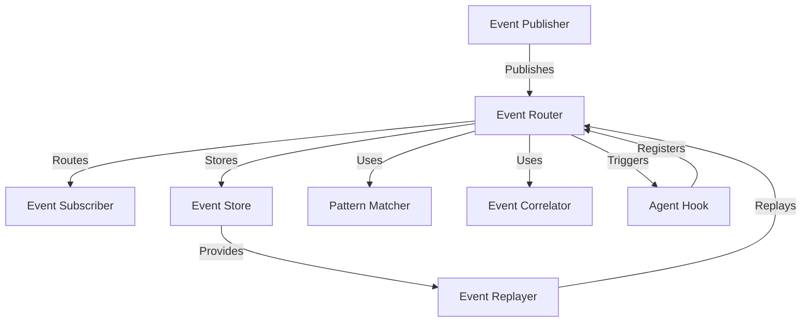

# Design Document: Event Routing System

## Overview

The Event Routing System is a core architectural component of the PHOENIXxHYDRA platform that enables decoupled communication between system components through an event-driven approach. This design document outlines the architecture, components, interfaces, and implementation details for the event routing system based on the requirements.

The system will provide a flexible, scalable mechanism for routing events from publishers to subscribers based on event types and patterns, supporting both synchronous and asynchronous communication models. It will include features for event filtering, correlation, and replay to ensure reliable message delivery and system recovery.

## Architecture

The Event Routing System follows a publish-subscribe architectural pattern with additional components for event filtering, correlation, and persistence. The high-level architecture consists of the following components:



### Key Components

1. **Event Router**: Central component responsible for receiving events from publishers and routing them to appropriate subscribers.
2. **Pattern Matcher**: Evaluates events against subscription patterns to determine which subscribers should receive an event.
3. **Event Correlator**: Tracks relationships between events and maintains correlation chains.
4. **Event Store**: Persists events for replay and recovery purposes.
5. **Event Replayer**: Facilitates replaying events from the event store.
6. **Agent Hook Integration**: Connects the event routing system with the agent hooks framework.

## Components and Interfaces

### Event Model

Events are the core data structure in the system. Each event has the following structure:

```python
class Event:
    id: str  # Unique identifier for the event
    type: str  # Event type (used for routing)
    source: str  # Component that generated the event
    timestamp: datetime  # When the event was created
    correlation_id: Optional[str]  # ID linking related events
    causation_id: Optional[str]  # ID of the event that caused this event
    payload: Dict[str, Any]  # Event data
    metadata: Dict[str, Any]  # Additional context information
```

### Event Router

The Event Router is the central component responsible for routing events from publishers to subscribers.

```python
class EventRouter:
    def publish(self, event: Event, mode: DeliveryMode = DeliveryMode.ASYNC) -> None:
        """Publish an event to all matching subscribers."""
        
    def subscribe(self, pattern: EventPattern, handler: EventHandler) -> Subscription:
        """Subscribe to events matching the given pattern."""
        
    def unsubscribe(self, subscription: Subscription) -> None:
        """Remove a subscription."""
        
    def register_hook(self, hook: AgentHook) -> None:
        """Register an agent hook with the event router."""
        
    def unregister_hook(self, hook: AgentHook) -> None:
        """Unregister an agent hook from the event router."""
```

### Pattern Matcher

The Pattern Matcher evaluates events against subscription patterns.

```python
class EventPattern:
    event_type: str  # Can include wildcards (e.g., "system.*")
    attributes: Dict[str, Any]  # Attribute filters
    
class PatternMatcher:
    def matches(self, event: Event, pattern: EventPattern) -> bool:
        """Check if an event matches a pattern."""
```

### Event Correlator

The Event Correlator tracks relationships between events.

```python
class EventCorrelator:
    def correlate(self, event: Event, parent_event: Optional[Event] = None) -> Event:
        """Correlate an event with a parent event or start a new correlation."""
        
    def get_correlation_chain(self, correlation_id: str) -> List[Event]:
        """Get all events in a correlation chain."""
```

### Event Store

The Event Store persists events for replay and recovery.

```python
class EventStore:
    def store(self, event: Event) -> None:
        """Store an event."""
        
    def get_events(self, 
                  filter_criteria: Optional[Dict[str, Any]] = None, 
                  start_time: Optional[datetime] = None,
                  end_time: Optional[datetime] = None) -> List[Event]:
        """Get events matching the filter criteria within the time range."""
        
    def get_event_by_id(self, event_id: str) -> Optional[Event]:
        """Get an event by its ID."""
```

### Event Replayer

The Event Replayer facilitates replaying events from the event store.

```python
class EventReplayer:
    def replay(self, 
              filter_criteria: Optional[Dict[str, Any]] = None,
              start_time: Optional[datetime] = None,
              end_time: Optional[datetime] = None) -> None:
        """Replay events matching the filter criteria within the time range."""
```

### Agent Hook Integration

Integration with the agent hooks framework.

```python
class EventHookTrigger:
    def register_hook(self, hook: AgentHook) -> None:
        """Register an agent hook for event triggering."""
        
    def unregister_hook(self, hook: AgentHook) -> None:
        """Unregister an agent hook."""
        
    def trigger_hook(self, hook: AgentHook, event: Event) -> None:
        """Trigger an agent hook with an event."""
```

## Data Models

### Event

The core data structure representing an event in the system.

```python
@dataclass
class Event:
    id: str
    type: str
    source: str
    timestamp: datetime
    correlation_id: Optional[str] = None
    causation_id: Optional[str] = None
    payload: Dict[str, Any] = field(default_factory=dict)
    metadata: Dict[str, Any] = field(default_factory=dict)
    is_replay: bool = False
```

### Subscription

Represents a subscription to events.

```python
@dataclass
class Subscription:
    id: str
    pattern: EventPattern
    handler: EventHandler
    active: bool = True
```

### EventPattern

Defines a pattern for matching events.

```python
@dataclass
class EventPattern:
    event_type: str  # Can include wildcards
    attributes: Dict[str, Any] = field(default_factory=dict)
```

### DeliveryMode

Enum defining event delivery modes.

```python
class DeliveryMode(Enum):
    SYNC = "sync"  # Synchronous delivery
    ASYNC = "async"  # Asynchronous delivery
```

## Error Handling

The Event Routing System will implement comprehensive error handling to ensure reliability:

1. **Subscription Errors**: When a subscriber handler raises an exception, the router will:
   - Log the exception
   - Optionally retry delivery based on configuration
   - Notify the error handling subsystem
   - Continue delivering to other subscribers

2. **Publication Errors**: When event publication fails, the system will:
   - Log the failure
   - Attempt to store the event for later retry
   - Notify the error handling subsystem

3. **Correlation Errors**: When correlation fails, the system will:
   - Log the error
   - Create a new correlation if needed
   - Continue processing the event

4. **Replay Errors**: When event replay encounters errors, the system will:
   - Log the error
   - Skip problematic events if configured to do so
   - Provide detailed error information for debugging

## Testing Strategy

The testing strategy for the Event Routing System includes:

1. **Unit Tests**:
   - Test each component in isolation with mocked dependencies
   - Verify pattern matching logic with various patterns
   - Test correlation tracking with different event sequences
   - Validate event store operations

2. **Integration Tests**:
   - Test the interaction between components
   - Verify end-to-end event flow from publication to delivery
   - Test correlation across multiple events
   - Validate event replay functionality

3. **Performance Tests**:
   - Measure event throughput under different loads
   - Test with high concurrency of publishers and subscribers
   - Evaluate pattern matching performance with complex patterns
   - Measure event store performance with large volumes

4. **Resilience Tests**:
   - Test system behavior when components fail
   - Verify recovery after failures
   - Test with simulated network issues
   - Validate event replay for recovery scenarios

## Implementation Considerations

1. **Concurrency**: The implementation will use asyncio for asynchronous event handling to support high throughput.

2. **Persistence**: Events will be stored in a configurable backend (in-memory for development, database for production).

3. **Performance Optimization**:
   - Efficient pattern matching algorithm
   - Indexed event store for fast retrieval
   - Batched event processing where appropriate

4. **Extensibility**:
   - Plugin architecture for custom pattern matchers
   - Configurable event store backends
   - Extensible correlation strategies

5. **Monitoring and Observability**:
   - Event throughput metrics
   - Subscription statistics
   - Pattern matching performance
   - Correlation tracking
   - Replay operations