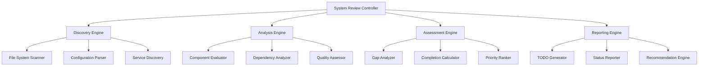

# Design Document

## Overview

The Phoenix Hydra System Review is designed as a comprehensive evaluation framework that systematically analyzes all components of the Phoenix Hydra stack to determine current completion status and generate a prioritized TODO checklist for achieving 100% completion. The system employs a multi-phase analysis approach combining automated discovery, structured assessment, gap analysis, and actionable reporting.

The design addresses the need to evaluate a complex, multi-layered system that includes core infrastructure (containers, databases, APIs), monetization components (affiliate programs, revenue tracking, grant applications), automation systems (deployment scripts, agent hooks, CI/CD), and operational readiness (monitoring, security, documentation).

## Architecture

### High-Level Architecture



### Component Architecture

The system is organized into four main processing phases:

1. **Discovery Phase**: Automated scanning and inventory of all system components
2. **Analysis Phase**: Detailed evaluation of each component against completion criteria
3. **Assessment Phase**: Gap analysis and completion percentage calculation
4. **Reporting Phase**: Generation of actionable TODO checklist and status reports

## Components and Interfaces

### Discovery Engine

**Purpose**: Automatically discover and inventory all Phoenix Hydra components, configurations, and dependencies.

**Key Components**:
- **File System Scanner**: Recursively scans project structure to identify all relevant files
- **Configuration Parser**: Parses YAML, JSON, TOML, and other configuration files
- **Service Discovery**: Identifies running services and their health status
- **Dependency Mapper**: Maps inter-component dependencies and relationships

**Interfaces**:
```python
class DiscoveryEngine:
    def scan_project_structure() -> ProjectInventory
    def parse_configurations() -> ConfigurationMap
    def discover_services() -> ServiceRegistry
    def map_dependencies() -> DependencyGraph
```

### Analysis Engine

**Purpose**: Evaluate each discovered component against predefined completion criteria and quality standards.

**Key Components**:
- **Component Evaluator**: Assesses individual components using specific evaluation criteria
- **Dependency Analyzer**: Validates component dependencies and integration points
- **Quality Assessor**: Evaluates code quality, documentation, and testing coverage

**Evaluation Criteria Framework**:
```python
class ComponentCriteria:
    infrastructure_criteria = {
        'nca_toolkit': ['api_endpoints', 'health_checks', 'documentation'],
        'podman_stack': ['compose_file', 'service_definitions', 'health_monitoring'],
        'database': ['schema', 'migrations', 'backup_strategy'],
        'storage': ['configuration', 'access_policies', 'monitoring']
    }
    
    monetization_criteria = {
        'affiliate_programs': ['badge_deployment', 'tracking_scripts', 'revenue_reporting'],
        'grant_applications': ['generators', 'documentation', 'submission_tracking'],
        'marketplace': ['listings', 'deployment_scripts', 'enterprise_features']
    }
```

**Interfaces**:
```python
class AnalysisEngine:
    def evaluate_component(component: Component, criteria: Criteria) -> EvaluationResult
    def analyze_dependencies(component: Component) -> DependencyStatus
    def assess_quality(component: Component) -> QualityMetrics
```

### Assessment Engine

**Purpose**: Calculate completion percentages, identify gaps, and prioritize remaining work items.

**Key Components**:
- **Gap Analyzer**: Identifies missing components, incomplete implementations, and configuration gaps
- **Completion Calculator**: Calculates weighted completion percentages for components and overall system
- **Priority Ranker**: Assigns priority levels based on business impact, technical complexity, and dependencies

**Completion Calculation Model**:
```python
class CompletionModel:
    component_weights = {
        'infrastructure': 0.35,
        'monetization': 0.25,
        'automation': 0.20,
        'documentation': 0.10,
        'testing': 0.05,
        'security': 0.05
    }
    
    def calculate_component_completion(evaluation_results: List[EvaluationResult]) -> float
    def calculate_overall_completion(component_scores: Dict[str, float]) -> float
```

**Interfaces**:
```python
class AssessmentEngine:
    def identify_gaps(evaluation_results: List[EvaluationResult]) -> List[Gap]
    def calculate_completion(component: Component) -> CompletionScore
    def prioritize_tasks(gaps: List[Gap]) -> List[PrioritizedTask]
```

### Reporting Engine

**Purpose**: Generate comprehensive reports, TODO checklists, and actionable recommendations.

**Key Components**:
- **TODO Generator**: Creates hierarchical, prioritized task lists with effort estimates
- **Status Reporter**: Generates executive summaries and detailed status reports
- **Recommendation Engine**: Provides strategic recommendations for completing remaining work

**Report Templates**:
- Executive Summary (high-level completion status and key metrics)
- Detailed Component Analysis (component-by-component breakdown)
- Prioritized TODO Checklist (actionable tasks with estimates and dependencies)
- Risk Assessment (production readiness and potential issues)
- Strategic Recommendations (next steps and resource allocation)

**Interfaces**:
```python
class ReportingEngine:
    def generate_todo_checklist(prioritized_tasks: List[PrioritizedTask]) -> TODOChecklist
    def create_status_report(assessment_results: AssessmentResults) -> StatusReport
    def provide_recommendations(gaps: List[Gap], priorities: List[Priority]) -> Recommendations
```

## Data Models

### Core Data Structures

```python
@dataclass
class Component:
    name: str
    category: ComponentCategory
    path: str
    dependencies: List[str]
    configuration: Dict[str, Any]
    status: ComponentStatus
    
@dataclass
class EvaluationResult:
    component: Component
    criteria_met: List[str]
    criteria_missing: List[str]
    completion_percentage: float
    quality_score: float
    issues: List[Issue]

@dataclass
class Gap:
    component: str
    description: str
    impact: ImpactLevel
    effort_estimate: int  # hours
    dependencies: List[str]
    acceptance_criteria: List[str]

@dataclass
class TODOTask:
    id: str
    title: str
    description: str
    category: str
    priority: Priority
    status: TaskStatus
    effort_hours: int
    dependencies: List[str]
    acceptance_criteria: List[str]
```

### Component Categories

```python
class ComponentCategory(Enum):
    INFRASTRUCTURE = "infrastructure"
    MONETIZATION = "monetization"
    AUTOMATION = "automation"
    DOCUMENTATION = "documentation"
    TESTING = "testing"
    SECURITY = "security"

class Priority(Enum):
    CRITICAL = "critical"
    HIGH = "high"
    MEDIUM = "medium"
    LOW = "low"

class TaskStatus(Enum):
    COMPLETE = "complete"
    IN_PROGRESS = "in_progress"
    NOT_STARTED = "not_started"
```

## Error Handling

### Error Categories

1. **Discovery Errors**: File system access issues, configuration parsing failures
2. **Analysis Errors**: Component evaluation failures, dependency resolution issues
3. **Assessment Errors**: Calculation errors, invalid criteria definitions
4. **Reporting Errors**: Template rendering issues, output generation failures

### Error Handling Strategy

```python
class SystemReviewError(Exception):
    def __init__(self, component: str, phase: str, message: str):
        self.component = component
        self.phase = phase
        self.message = message

class ErrorHandler:
    def handle_discovery_error(error: DiscoveryError) -> PartialResults
    def handle_analysis_error(error: AnalysisError) -> SkippedComponent
    def handle_assessment_error(error: AssessmentError) -> EstimatedResult
    def handle_reporting_error(error: ReportingError) -> FallbackReport
```

### Graceful Degradation

- Continue processing other components when individual components fail
- Provide partial results with clear indication of missing data
- Generate fallback reports when primary templates fail
- Log all errors for debugging and improvement

## Testing Strategy

### Unit Testing

- **Component Tests**: Test individual discovery, analysis, assessment, and reporting components
- **Data Model Tests**: Validate data structure integrity and serialization
- **Criteria Tests**: Verify evaluation criteria logic and scoring algorithms
- **Error Handling Tests**: Test error scenarios and graceful degradation

### Integration Testing

- **End-to-End Tests**: Full system review workflow from discovery to reporting
- **Component Integration Tests**: Test interactions between discovery, analysis, and assessment engines
- **Configuration Tests**: Validate parsing and processing of various configuration formats
- **Service Integration Tests**: Test service discovery and health checking

### Test Data Management

```python
class TestDataManager:
    def create_mock_project_structure() -> ProjectStructure
    def generate_test_configurations() -> ConfigurationSet
    def create_sample_components() -> ComponentSet
    def setup_test_services() -> ServiceRegistry
```

### Performance Testing

- **Scalability Tests**: Test with large project structures and many components
- **Memory Usage Tests**: Monitor memory consumption during analysis
- **Processing Time Tests**: Measure analysis time for different project sizes
- **Concurrent Processing Tests**: Test parallel component analysis

### Validation Testing

- **Accuracy Tests**: Validate completion percentage calculations against known baselines
- **Consistency Tests**: Ensure consistent results across multiple runs
- **Criteria Validation**: Test evaluation criteria against real Phoenix Hydra components
- **Report Validation**: Verify generated reports match expected formats and content

## Implementation Phases

### Phase 1: Core Framework (Foundation)
- Implement basic discovery engine with file system scanning
- Create component evaluation framework with basic criteria
- Develop simple completion calculation logic
- Build basic TODO checklist generation

### Phase 2: Phoenix Hydra Integration (Specialization)
- Implement Phoenix Hydra specific component criteria
- Add configuration parsing for Podman, n8n, Windmill
- Integrate service health checking for all Phoenix services
- Add monetization component evaluation logic

### Phase 3: Advanced Analysis (Enhancement)
- Implement dependency analysis and validation
- Add quality assessment with code analysis
- Develop sophisticated priority ranking algorithms
- Create comprehensive reporting templates

### Phase 4: Production Readiness (Finalization)
- Add comprehensive error handling and logging
- Implement performance optimizations
- Create extensive test suite with high coverage
- Add monitoring and observability features

This design provides a robust, extensible framework for comprehensively evaluating the Phoenix Hydra system and generating actionable TODO checklists to achieve 100% completion.