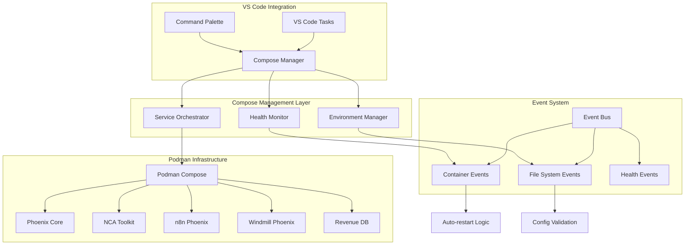

# Design Document

## Overview

The Podman Compose Automation system provides a comprehensive solution for managing Phoenix Hydra services using Podman's rootless container orchestration. The system integrates with the existing Agent Hooks architecture to provide automated deployment, health monitoring, and environment management capabilities. The design leverages Phoenix Hydra's event-driven architecture and VS Code integration to create a seamless developer experience.

## Architecture

### High-Level Architecture



### Component Architecture

The system consists of four main architectural layers:

1. **Interface Layer**: VS Code tasks and command palette integration
2. **Management Layer**: Core orchestration and monitoring logic
3. **Event Layer**: Integration with Phoenix Hydra's event bus system
4. **Infrastructure Layer**: Podman containers and compose configurations

## Components and Interfaces

### 1. Compose Manager (`src/containers/compose_manager.py`)

The central orchestration component that manages all Podman Compose operations.

**Key Responsibilities:**
- Execute compose commands (up, down, restart, logs)
- Coordinate with environment manager for configuration
- Integrate with health monitor for service status
- Emit events for container lifecycle changes

**Interface:**
```python
class ComposeManager:
    async def start_services(self, environment: str = "development") -> ComposeResult
    async def stop_services(self, graceful: bool = True) -> ComposeResult
    async def restart_services(self, services: List[str] = None) -> ComposeResult
    async def get_service_status(self) -> Dict[str, ServiceStatus]
    async def get_service_logs(self, service: str, lines: int = 100) -> str
    async def validate_compose_files(self) -> ValidationResult
```

### 2. Environment Manager (`src/containers/environment_manager.py`)

Handles environment-specific configuration and compose file selection.

**Key Responsibilities:**
- Load environment-specific configurations
- Validate configuration files
- Merge compose files for different environments
- Manage secrets and environment variables

**Interface:**
```python
class EnvironmentManager:
    def load_environment_config(self, env: str) -> EnvironmentConfig
    def validate_config(self, config: EnvironmentConfig) -> ValidationResult
    def get_compose_files(self, env: str) -> List[Path]
    def resolve_environment_variables(self, env: str) -> Dict[str, str]
```

### 3. Health Monitor (`src/containers/health_monitor.py`)

Monitors container health and implements auto-restart logic.

**Key Responsibilities:**
- Continuous health checking of all services
- Implement restart policies for failed containers
- Generate health events for the event bus
- Collect and report performance metrics

**Interface:**
```python
class HealthMonitor:
    async def start_monitoring(self) -> None
    async def stop_monitoring(self) -> None
    async def check_service_health(self, service: str) -> HealthStatus
    async def restart_unhealthy_services(self) -> List[RestartResult]
    def get_health_metrics(self) -> Dict[str, Any]
```

### 4. VS Code Integration (`src/containers/vscode_integration.py`)

Provides seamless integration with VS Code tasks and commands.

**Key Responsibilities:**
- Register VS Code tasks for common operations
- Provide real-time status updates in VS Code
- Handle user interactions and confirmations
- Display logs and error messages in VS Code terminal

**Interface:**
```python
class VSCodeIntegration:
    def register_tasks(self) -> None
    async def execute_task(self, task_name: str, args: Dict[str, Any]) -> TaskResult
    def show_status_notification(self, message: str, level: str) -> None
    def open_logs_panel(self, service: str) -> None
```

### 5. Event Integration (`src/containers/event_integration.py`)

Integrates with Phoenix Hydra's event bus system for automated responses.

**Key Responsibilities:**
- Subscribe to relevant system events
- Emit container lifecycle events
- Handle file system changes that affect containers
- Coordinate with agent hooks for automation

**Interface:**
```python
class EventIntegration:
    async def setup_event_subscriptions(self) -> None
    async def handle_file_change_event(self, event: Event) -> None
    async def handle_container_event(self, event: Event) -> None
    async def emit_container_lifecycle_event(self, event_type: str, data: Dict) -> None
```

## Data Models

### Service Configuration Model

```python
@dataclass
class ServiceConfig:
    name: str
    image: str
    ports: List[str]
    environment: Dict[str, str]
    volumes: List[str]
    depends_on: List[str]
    health_check: Optional[HealthCheckConfig]
    restart_policy: RestartPolicy
```

### Environment Configuration Model

```python
@dataclass
class EnvironmentConfig:
    name: str
    compose_files: List[str]
    environment_variables: Dict[str, str]
    secrets_config: Optional[SecretsConfig]
    resource_limits: Optional[ResourceLimits]
    monitoring_config: MonitoringConfig
```

### Health Status Model

```python
@dataclass
class HealthStatus:
    service_name: str
    status: str  # healthy, unhealthy, starting, stopped
    last_check: datetime
    response_time: Optional[float]
    error_message: Optional[str]
    restart_count: int
    uptime: timedelta
```

## Error Handling

### Error Categories

1. **Configuration Errors**: Invalid compose files, missing environment variables
2. **Runtime Errors**: Container startup failures, network issues
3. **Health Check Errors**: Service unresponsive, resource exhaustion
4. **Integration Errors**: VS Code communication failures, event bus issues

### Error Handling Strategy

```python
class ErrorHandler:
    async def handle_configuration_error(self, error: ConfigurationError) -> None:
        # Log error details
        # Show user-friendly error message in VS Code
        # Suggest remediation steps
        # Prevent deployment with invalid configuration
    
    async def handle_runtime_error(self, error: RuntimeError) -> None:
        # Attempt automatic recovery
        # Log error for debugging
        # Notify user if manual intervention required
        # Update service status
    
    async def handle_health_check_error(self, error: HealthCheckError) -> None:
        # Implement restart policy
        # Escalate if restart attempts fail
        # Update monitoring metrics
        # Send notifications if configured
```

### Retry and Recovery Mechanisms

- **Exponential Backoff**: For transient failures
- **Circuit Breaker**: Prevent cascading failures
- **Graceful Degradation**: Continue with reduced functionality
- **Manual Override**: Allow user intervention when needed

## Testing Strategy

### Unit Testing

- **Component Isolation**: Test each component independently
- **Mock Dependencies**: Use mocks for external dependencies (Podman, VS Code)
- **Error Scenarios**: Test error handling and edge cases
- **Configuration Validation**: Test various configuration scenarios

### Integration Testing

- **End-to-End Workflows**: Test complete deployment scenarios
- **Event System Integration**: Test event bus interactions
- **VS Code Integration**: Test task execution and UI interactions
- **Multi-Environment Testing**: Test different environment configurations

### Container Testing

- **Health Check Validation**: Test health check implementations
- **Resource Limits**: Test container resource constraints
- **Network Connectivity**: Test inter-service communication
- **Data Persistence**: Test volume mounting and data persistence

### Performance Testing

- **Startup Time**: Measure service startup performance
- **Resource Usage**: Monitor CPU and memory consumption
- **Concurrent Operations**: Test multiple simultaneous operations
- **Scalability**: Test with varying numbers of services

## Security Considerations

### Rootless Container Execution

- All containers run in rootless mode using Podman
- User namespace mapping for host resource access
- No privileged container execution
- Secure default configurations

### Secrets Management

- Integration with external secrets management systems
- No secrets in compose files or environment variables
- Encrypted secrets storage
- Rotation and lifecycle management

### Network Security

- Isolated container networks
- Minimal port exposure
- TLS encryption for inter-service communication
- Network policies for service isolation

### Access Control

- Role-based access to container operations
- Audit logging for all administrative actions
- Secure API endpoints with authentication
- VS Code integration security

## Performance Optimization

### Container Optimization

- Multi-stage Docker builds for smaller images
- Resource limits and requests configuration
- Efficient volume mounting strategies
- Container image caching

### Monitoring and Metrics

- Prometheus integration for metrics collection
- Grafana dashboards for visualization
- Custom metrics for Phoenix Hydra specific operations
- Performance alerting and notifications

### Caching Strategies

- Compose file parsing cache
- Configuration validation cache
- Health check result caching
- Event processing optimization

## Deployment Considerations

### Development Environment

- Local Podman installation
- VS Code with required extensions
- Development-specific compose configurations
- Hot-reload capabilities for rapid development

### Production Environment

- Systemd service integration
- Production-grade monitoring
- Backup and disaster recovery
- High availability configurations

### CI/CD Integration

- Automated testing in CI pipelines
- Container image building and scanning
- Deployment automation
- Environment promotion workflows