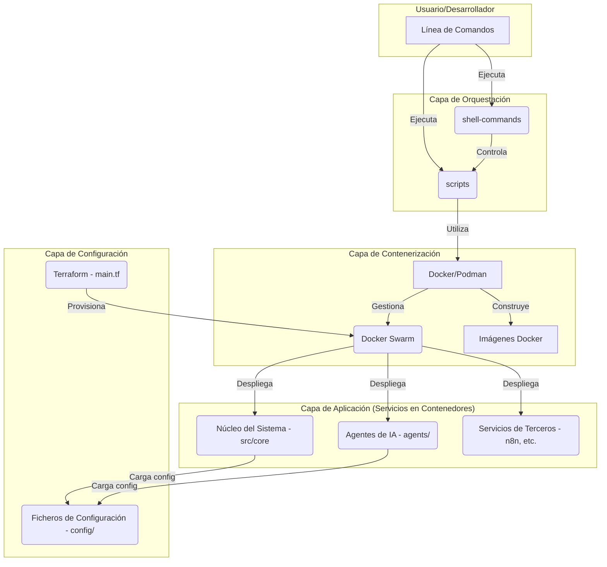

# Arquitectura del Sistema: Phoenix DemiGod

Este documento describe la arquitectura técnica del sistema Phoenix DemiGod, una plataforma de IA híbrida y local para el desarrollo asistido y la orquestación de agentes múltiples.

## 1. Visión General

La arquitectura está diseñada en torno a un **monorepo políglota** que favorece la modularidad, la escalabilidad y la gestión centralizada. El sistema utiliza **Docker Swarm** para la orquestación de contenedores, lo que permite un despliegue y una gestión de servicios robusta y distribuida.

El flujo de trabajo se controla mediante un conjunto de **scripts de orquestación** que automatizan las tareas de construcción, despliegue, configuración y monitorización.

## 2. Diagrama de Arquitectura

El siguiente diagrama ilustra los componentes principales y sus interacciones:

## 3. Componentes Principales

### 3.1. Capa de Orquestación

Es el punto de entrada para interactuar con el sistema.

-   **`shell-commands/`**: Contiene scripts de alto nivel que orquestan flujos de trabajo complejos. Por ejemplo, `phoenix-orchestrator.sh` gestiona el ciclo de vida completo del sistema, mientras que los scripts en `hierarchy/` despliegan jerarquías de agentes específicas. Consulta el [`README.md`](./BooPhoenix369/shell-commands/README.md) para más detalles.
-   **`scripts/`**: Alberga scripts de utilidad para tareas más granulares como construir imágenes (`build-images.sh`), desplegar la pila de servicios (`deploy-stack.sh`) o monitorizarla (`monitor-stack.sh`). Consulta el [`README.md`](./BooPhoenix369/scripts/README.md) para más detalles.

### 3.2. Capa de Contenerización

Abstrae el entorno de ejecución de la aplicación.

-   **Docker/Podman**: Motores de contenedores utilizados para empaquetar y ejecutar los servicios.
-   **Docker Swarm**: Herramienta de orquestación nativa de Docker que gestiona el clúster de nodos y el despliegue de servicios distribuidos.
-   **`docker/`**: Este directorio contiene los `Dockerfiles` para construir las imágenes de cada servicio y los ficheros `docker-compose.yml` que definen la pila de servicios.

### 3.3. Capa de Aplicación

Contiene la lógica de negocio y la inteligencia del sistema.

-   **`src/core/`**: El cerebro del sistema. Incluye módulos para la gestión de la memoria (`holographic_memory.py`), el procesamiento del lenguaje (`quantum_attention.py`), la optimización (`quantum_gradient_descent.py`) y la toma de decisiones éticas (`ethical_governance.py`). Consulta el [`README.md`](./BooPhoenix369/src/core/README.md) para una descripción detallada.
-   **`agents/`**: Define las diferentes jerarquías de agentes de IA (cognitivos, micelares, neuronales) que ejecutan tareas especializadas.
-   **Integraciones**: El sistema se integra con herramientas de terceros como **n8n** para la automatización de flujos de trabajo.

### 3.4. Capa de Configuración

Gestiona la configuración del sistema y la infraestructura.

-   **`config/`**: Almacena ficheros de configuración (`.yaml`, `.toml`) que definen el comportamiento de los agentes, los modelos y la comunicación entre servicios.
-   **`main.tf`**: Fichero principal de **Terraform** para la provisión de la infraestructura como código (IaC), aunque en la fase actual el foco está en el despliegue local con Docker Swarm.

## 4. Flujo de Trabajo (Workflow)

1.  **Inicialización**: El desarrollador ejecuta un script de alto nivel como `phoenix-install.sh` o `phoenix-master.sh`.
2.  **Orquestación**: Estos scripts llaman a otros scripts en `shell-commands/` y `scripts/` para realizar tareas específicas en orden.
3.  **Construcción**: El script `build-images.sh` es invocado para construir las imágenes de Docker necesarias a partir de los `Dockerfiles`.
4.  **Despliegue**: El script `deploy-stack.sh` utiliza `docker stack deploy` para desplegar los servicios definidos en el `docker-compose.yml` en el clúster de Docker Swarm.
5.  **Ejecución**: Los contenedores se inician, cargando su configuración desde el directorio `config/`. Los servicios se comunican entre sí a través de la red definida por Docker Swarm.
6.  **Monitorización**: El script `monitor-stack.sh` puede ser utilizado para observar el estado y los logs de los servicios en ejecución.

## 5. Jerarquía de Agentes

El sistema emplea un modelo jerárquico de agentes para la distribución de tareas y la toma de decisiones:

-   **Agentes Cognitivos**: Responsables del razonamiento de alto nivel, la planificación estratégica y la supervisión del sistema.
-   **Agentes Neuronales**: Especializados en tareas de procesamiento de datos intensivo, como el entrenamiento de modelos o el análisis de grandes volúmenes de información.
-   **Agentes Micelares**: Unidades de trabajo más pequeñas y especializadas que ejecutan tareas atómicas, como la recopilación de datos o la interacción con una API específica.

La comunicación entre agentes se define en los ficheros de configuración y se orquesta a través de los componentes del núcleo.