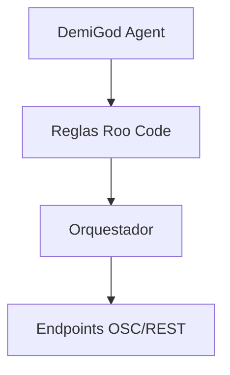

# DemiGod Agent

## Propósito
El DemiGod Agent es el orquestador principal del sistema Phoenix DemiGod. Se encarga de tomar decisiones estratégicas y coordinar las acciones de otros agentes.

## Uso
Para ejecutar el DemiGod Agent, usa el siguiente comando:
```bash
./autogen/scripts/demigod-agent.sh --verbose
```

## Diagrama de Flujo


## Configuración
La configuración del DemiGod Agent se encuentra en `omas/agents/demigod-agent.yaml`. Asegúrate de personalizar los endpoints y reglas según tu entorno.