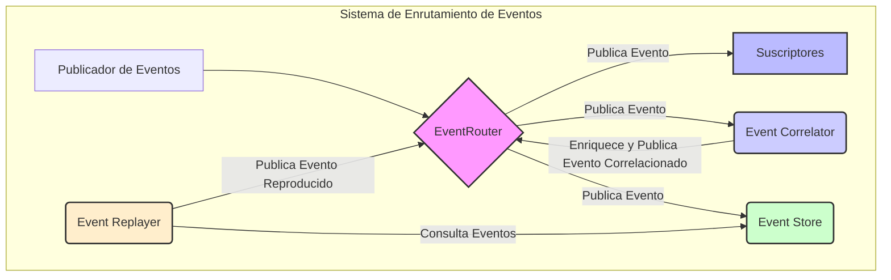

# Arquitectura del Sistema de Enrutamiento de Eventos

## 1. Resumen

Este documento define la arquitectura para los componentes centrales del Sistema de Enrutamiento de Eventos: **Event Store**, **Event Correlator** y **Event Replayer**. El diseño se basa en las interfaces y modelos de datos definidos en `src/event_routing/event_routing.py` y tiene como objetivo proporcionar una solución robusta, escalable y mantenible.

## 2. Diagrama de Arquitectura General

El siguiente diagrama ilustra cómo los nuevos componentes interactúan entre sí y con el `EventRouter` existente.



**Flujo de Datos:**
1.  Un **Publicador de Eventos** envía un evento al `EventRouter`.
2.  El `EventRouter` distribuye el evento a todos los **Suscriptores** que coincidan con el patrón del evento.
3.  El `EventRouter` también envía una copia del evento al **Event Correlator** y al **Event Store**.
4.  El **Event Correlator** procesa el evento para identificar relaciones. Si se crea una nueva correlación o se añade a una existente, puede enriquecer el evento y publicarlo de nuevo en el `EventRouter`.
5.  El **Event Store** persiste el evento para su almacenamiento a largo plazo y futura recuperación.
6.  El **Event Replayer** puede consultar el `EventStore` para recuperar secuencias de eventos y publicarlas de nuevo en el `EventRouter`, simulando su ocurrencia original.

---

## 3. Diseño de Componentes

### 3.1. Event Store

El `EventStore` es responsable de la persistencia y recuperación de todos los eventos que fluyen a través del sistema. La implementación actual en memoria es solo un prototipo y será reemplazada por una solución más robusta.

#### 3.1.1. Interfaz Abstracta

Se definirá una interfaz `EventStoreBase` en `src/event_routing/event_store.py` para desacoplar la lógica del `EventRouter` del mecanismo de almacenamiento subyacente.

```python
# src/event_routing/event_store.py

from abc import ABC, abstractmethod
from typing import List, Optional, Dict, Any
from .event_routing import Event

class EventStoreBase(ABC):
    @abstractmethod
    def store(self, event: Event) -> None:
        """Persiste un único evento."""
        pass

    @abstractmethod
    def get_event_by_id(self, event_id: str) -> Optional[Event]:
        """Recupera un evento por su ID."""
        pass

    @abstractmethod
    def query_events(self, filter_criteria: Dict[str, Any]) -> List[Event]:
        """Consulta eventos basados en criterios de filtrado."""
        pass
```

#### 3.1.2. Mecanismo de Almacenamiento

Se recomienda utilizar una base de datos documental como **MongoDB** o una base de datos de series temporales como **InfluxDB**, ya que están optimizadas para los patrones de consulta y almacenamiento de eventos. La elección final dependerá de los requisitos de rendimiento y consulta. Se creará una implementación concreta de `EventStoreBase` para el backend elegido (p. ej., `MongoEventStore`).

#### 3.1.3. Esquema de Datos

El esquema de almacenamiento se basará directamente en la clase `Event` de `src/event_routing/event_routing.py`. Los eventos se almacenarán en un formato serializado como JSON o BSON.

**Campos Clave para Indexación:**
*   `id` (índice único)
*   `timestamp` (índice para consultas de rango de tiempo)
*   `type` (índice para filtrado por tipo de evento)
*   `correlation_id` (índice para recuperar cadenas de eventos)
*   `source`

#### 3.1.4. API Detallada (`query_events`)

El método `query_events` soportará filtros complejos:
*   Rango de tiempo (`start_time`, `end_time`).
*   Coincidencia exacta por `type`, `source`, `correlation_id`.
*   Filtros sobre campos del `payload` usando notación de puntos (p. ej., `payload.user.id`).
*   Paginación y ordenación.

---

### 3.2. Event Correlator

El `EventCorrelator` es un suscriptor especializado que identifica y agrupa eventos relacionados en cadenas de causalidad.

#### 3.2.1. Lógica de Correlación

1.  **Suscripción Universal:** El `EventCorrelator` se suscribirá a todos los eventos (`*`).
2.  **Inicio de Correlación:** Si un evento llega sin `correlation_id`, el correlator inicia una nueva cadena de correlación:
    *   Genera un nuevo `correlation_id`.
    *   Asigna este ID al evento.
    *   Publica una versión enriquecida del evento de nuevo en el `EventRouter`.
3.  **Mantenimiento de Causalidad:** Si un evento es derivado de otro (usando `event.derive()`), el `causation_id` (el ID del evento original) y el `correlation_id` se propagan automáticamente. El `EventCorrelator` valida esta cadena.

#### 3.2.2. Integración

El `EventCorrelator` se implementará como una clase que se instancia y se suscribe al `EventRouter` durante el arranque del sistema. No modificará los eventos en tránsito directamente, sino que publicará eventos nuevos y enriquecidos para no interferir con otros suscriptores.

#### 3.2.3. API

La interfaz del `EventCorrelator` será principalmente interna, pero expondrá métodos para análisis y depuración.

```python
# src/event_routing/event_correlator.py

class EventCorrelator:
    def __init__(self, router: EventRouter, event_store: EventStoreBase):
        self.router = router
        self.event_store = event_store

    def handle_event(self, event: Event) -> None:
        """
        Manejador de eventos para la suscripción.
        Enriquece el evento con IDs de correlación si es necesario.
        """
        if event.correlation_id is None:
            # Inicia una nueva cadena de correlación
            correlation_id = str(uuid.uuid4())
            enriched_event = dataclasses.replace(event, correlation_id=correlation_id)
            
            # Publica el evento enriquecido
            self.router.publish(enriched_event)

    def get_correlation_chain(self, correlation_id: str) -> List[Event]:
        """Recupera una cadena completa de eventos correlacionados desde el EventStore."""
        return self.event_store.query_events(filter_criteria={'correlation_id': correlation_id})
```

---

### 3.3. Event Replayer

El `EventReplayer` proporciona la capacidad de volver a reproducir secuencias de eventos desde el `EventStore`. Es crucial para pruebas, depuración y recuperación de estados.

#### 3.3.1. Mecanismo de Reproducción

1.  **Consulta al EventStore:** El `EventReplayer` consulta al `EventStore` para obtener una lista de eventos basada en criterios de reproducción (p. ej., por `correlation_id` o rango de tiempo).
2.  **Publicación en el Router:** Itera sobre los eventos recuperados y los publica en el `EventRouter`.
3.  **Marcado de Reproducción:** Cada evento reproducido tendrá el flag `is_replay` establecido en `True`. Esto permite a los suscriptores distinguir entre eventos en vivo y eventos reproducidos.
4.  **Control de Velocidad:** La reproducción puede ser instantánea o a una velocidad controlada (p. ej., `1x`, `2x` la velocidad original) para simular el flujo de eventos en tiempo real.

#### 3.3.2. API

La API del `EventReplayer` permitirá un control granular sobre el proceso de reproducción.

```python
# src/event_routing/event_replayer.py

class EventReplayer:
    def __init__(self, router: EventRouter, event_store: EventStoreBase):
        self.router = router
        self.event_store = event_store

    def replay_by_correlation_id(self, correlation_id: str, speed_multiplier: float = 0) -> None:
        """
        Reproduce una cadena de eventos por su ID de correlación.
        Si speed_multiplier es 0, la reproducción es instantánea.
        """
        events = self.event_store.query_events({'correlation_id': correlation_id})
        self._replay_events(events, speed_multiplier)

    def replay_by_time_range(self, start_time: datetime, end_time: datetime, filters: Dict[str, Any] = None, speed_multiplier: float = 0) -> None:
        """
        Reproduce eventos dentro de un rango de tiempo, con filtros opcionales.
        """
        query = {'start_time': start_time, 'end_time': end_time, **(filters or {})}
        events = self.event_store.query_events(query)
        self._replay_events(events, speed_multiplier)

    def _replay_events(self, events: List[Event], speed_multiplier: float) -> None:
        """Lógica central de reproducción de eventos."""
        # Ordenar por timestamp para una reproducción correcta
        sorted_events = sorted(events, key=lambda e: e.timestamp)
        
        for i, event in enumerate(sorted_events):
            # Marcar como evento de replay
            replayed_event = dataclasses.replace(event, is_replay=True)
            self.router.publish(replayed_event)

            if speed_multiplier > 0 and i + 1 < len(sorted_events):
                # Esperar para simular el tiempo original
                time_diff = (sorted_events[i+1].timestamp - event.timestamp).total_seconds()
                time.sleep(time_diff / speed_multiplier)