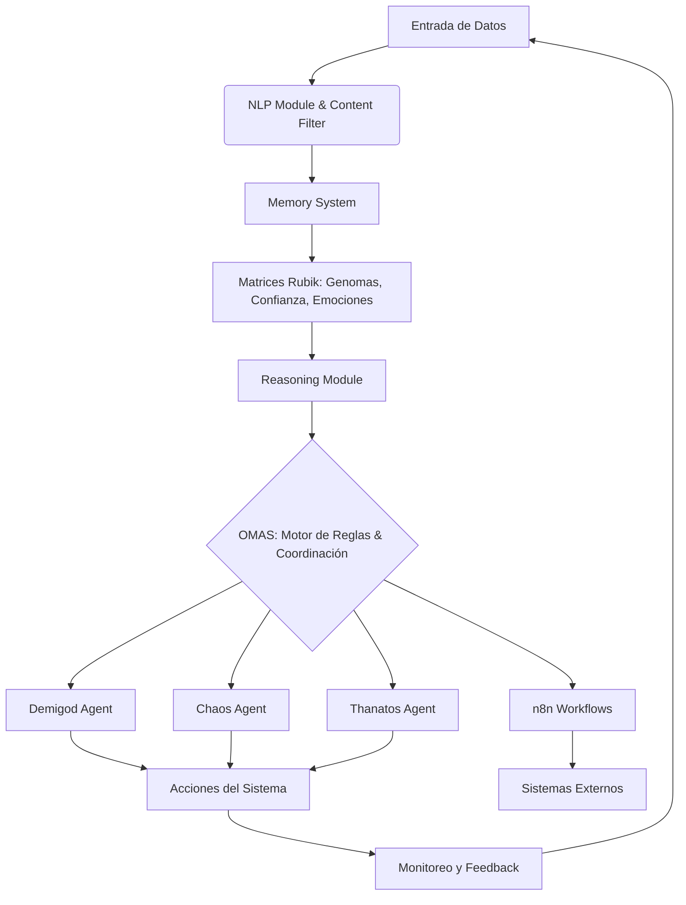

# Arquitectura del Sistema

El sistema Phoenix Demigod está diseñado con una arquitectura modular y distribuida, centrada en la inteligencia artificial y la automatización. Utiliza un enfoque de múltiples agentes y un motor de reglas para gestionar y orquestar operaciones complejas.

## Diagrama
### Componentes Principales

1.  **Matrices Rubik**: Utilizadas para modelar y gestionar conceptos complejos como genomas, confianza y emociones dentro del sistema. Estas matrices proporcionan una estructura de datos multidimensional para el procesamiento de información contextual.

2.  **Agentes de IA**:
    -   **Demigod Agent**: El agente principal encargado de la toma de decisiones de alto nivel y la orquestación general.
    -   **Chaos Agent**: Diseñado para inyectar fallos controlados y probar la resiliencia del sistema, siguiendo principios de Chaos Engineering.
    -   **Thanatos Agent**: Responsable de la gestión de recursos y la terminación controlada de procesos o servicios para mantener la estabilidad.

3.  **OMAS (Orchestration, Management, and Automation System)**:
    El corazón de la coordinación de agentes. OMAS utiliza un motor de reglas para procesar entradas, tomar decisiones y dirigir las acciones de los agentes. Es fundamental para la adaptabilidad y la respuesta dinámica del sistema.

4.  **n8n Workflows**:
    Integrado para la automatización de flujos de trabajo y la conexión con servicios externos. n8n permite la creación de automatizaciones complejas sin código, facilitando la integración de Phoenix Demigod con otras plataformas y APIs.

5.  **Módulos de Procesamiento**:
    -   **NLP Module**: Encargado del procesamiento del lenguaje natural para entender y generar texto.
    -   **Memory System**: Gestiona la persistencia y recuperación de la información, crucial para el aprendizaje y la adaptación del sistema.
    -   **Reasoning Module**: Implementa la lógica de razonamiento para inferir conclusiones y tomar decisiones basadas en el conocimiento disponible.
    -   **Content Filter**: Asegura que las interacciones y el contenido generado cumplan con las políticas de seguridad y ética.

### Flujo de Operación General

El sistema opera de la siguiente manera:

1.  **Entrada de Datos**: La información se ingesta a través de diversas fuentes y es procesada por módulos como el NLP y el Content Filter.
2.  **Modelado de Contexto**: Las Matrices Rubik modelan el contexto actual del sistema, incluyendo estados internos, genomas, confianza y emociones.
3.  **Decisión de Agentes**: Los agentes (Demigod, Chaos, Thanatos) reciben información y, coordinados por OMAS, toman decisiones basadas en sus reglas y objetivos.
4.  **Orquestación de OMAS**: OMAS evalúa las reglas de decisión y orquesta las acciones de los agentes, asegurando que se ejecuten las tareas adecuadas en el momento oportuno.
5.  **Automatización con n8n**: Para tareas que requieren interacción con sistemas externos o flujos de trabajo complejos, OMAS puede activar flujos de n8n.
6.  **Ejecución y Monitoreo**: Los agentes ejecutan sus tareas, y el sistema monitorea continuamente su rendimiento y el estado general para permitir ajustes dinámicos.

