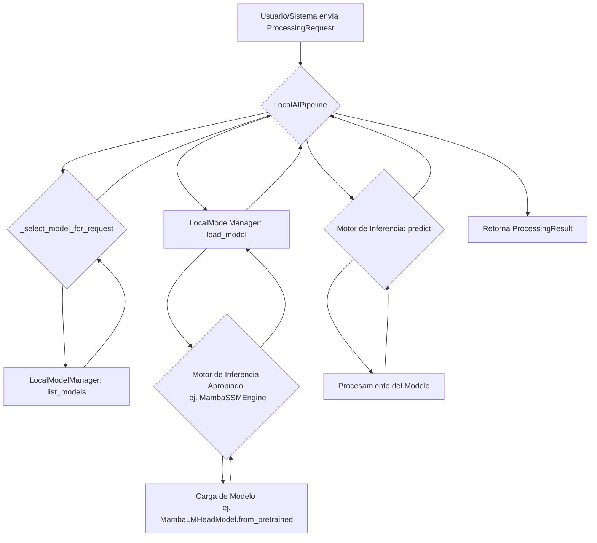

# Arquitectura de Procesamiento Local con Mamba/SSM

## 1. Introducción

Este documento describe la arquitectura propuesta para integrar modelos de lenguaje no basados en transformadores (Mamba/SSM) en el pipeline de procesamiento local del proyecto Phoenix Hydra. El objetivo es habilitar capacidades de inferencia 100% offline, mejorar la eficiencia energética y reducir la dependencia de hardware de alta gama, en línea con los objetivos estratégicos definidos en el `consolidated_steering_document.md`.

## 2. Arquitectura Propuesta

La solución se basa en la **extensión y unificación** de los componentes existentes en `src/local_processing` y `src/phoenix_system_review/mamba_integration`. En lugar de crear un sistema paralelo, se integrará un motor de inferencia Mamba genérico dentro del `LocalAIPipeline` existente, gestionado por el `LocalModelManager`.

La arquitectura se centrará en los siguientes principios:
- **Modularidad:** El motor de inferencia para Mamba será un componente conectable.
- **Abstracción:** El `LocalAIPipeline` no necesitará conocer los detalles internos de cómo se ejecuta un modelo Mamba versus un transformador.
- **Gestión Unificada:** El `LocalModelManager` será la única fuente de verdad para descubrir, cargar y gestionar todos los modelos locales, incluidos los de tipo Mamba/SSM.

## 3. Componentes Nuevos y Modificados

### 3.1. Nuevo Componente: `InferenceEngine`

Se creará una clase base abstracta `InferenceEngine` para estandarizar la forma en que el pipeline interactúa con diferentes tipos de modelos.

```python
# Propuesta para un nuevo fichero: src/local_processing/engines/base.py
from abc import ABC, abstractmethod
from .model_manager import ModelMetadata

class InferenceEngine(ABC):
    @abstractmethod
    def can_load(self, metadata: ModelMetadata) -> bool:
        """Verifica si este motor puede cargar el modelo dado."""
        pass

    @abstractmethod
    async def load_model(self, metadata: ModelMetadata) -> Any:
        """Carga el modelo en memoria."""
        pass

    @abstractmethod
    async def predict(self, model: Any, data: Any, options: Dict) -> Any:
        """Ejecuta la inferencia."""
        pass
```

### 3.2. Nuevo Componente: `MambaSSMEngine`

Se refactorizará el `mamba_engine.py` existente para que implemente la interfaz `InferenceEngine`. Este motor contendrá la lógica específica para cargar y ejecutar modelos Mamba utilizando la librería `mamba-ssm` o el fallback de `transformers`.

```python
# Propuesta para un nuevo fichero: src/local_processing/engines/mamba.py
from .base import InferenceEngine
from .model_manager import ModelMetadata

class MambaSSMEngine(InferenceEngine):
    def can_load(self, metadata: ModelMetadata) -> bool:
        return metadata.model_type in ["mamba", "ssm"]

    async def load_model(self, metadata: ModelMetadata) -> Any:
        # Lógica de carga de mamba_engine.py
        pass

    async def predict(self, model: Any, data: Any, options: Dict) -> Any:
        # Lógica de inferencia de mamba_engine.py
        pass
```

### 3.3. Modificaciones en `LocalModelManager`

El `LocalModelManager` ([`src/local_processing/model_manager.py`](src/local_processing/model_manager.py:1)) requiere modificaciones menores para ser más genérico:

- **`_load_model_file` será eliminado:** La carga de modelos ya no será responsabilidad directa del manager. Su función `load_model` se centrará en coordinar con el motor de inferencia adecuado.
- **Registro de Motores:** Se añadirá un mecanismo para registrar los diferentes motores de inferencia disponibles (`MambaSSMEngine`, `TransformerEngine`, etc.).

### 3.4. Modificaciones en `LocalAIPipeline`

El `LocalAIPipeline` ([`src/local_processing/pipeline.py`](src/local_processing/pipeline.py:1)) orquestará el proceso utilizando los motores de inferencia:

- **`_process_request`:** Esta función ya no llamará a un orquestador genérico, sino que:
    1. Usará el `LocalModelManager` para obtener los metadatos del modelo seleccionado.
    2. Identificará el `InferenceEngine` correcto para ese tipo de modelo.
    3. Solicitará al `LocalModelManager` que cargue el modelo usando el motor correspondiente.
    4. Ejecutará la inferencia a través del método `predict` del motor.

## 4. Flujo de Datos de Inferencia

El siguiente diagrama ilustra el flujo de datos desde la solicitud hasta la respuesta.



## 5. Estrategia 100% Offline

La garantía de un funcionamiento 100% offline se basa en los siguientes pilares:

1.  **Modelos Locales:** Todos los modelos Mamba/SSM necesarios se distribuyen con la aplicación y se almacenan en el directorio `models/`. El `LocalModelManager` opera exclusivamente sobre este directorio.
2.  **Dependencias Empaquetadas:** Las dependencias de Python (`mamba-ssm`, `transformers`, `torch`) deben estar incluidas en el entorno de ejecución. No se realizarán descargas de dependencias en tiempo de ejecución.
3.  **Sin Llamadas de Red:** El `MambaSSMEngine` y el `LocalModelManager` no deben contener ninguna llamada a APIs externas o de red para la carga o ejecución de modelos. La función `from_pretrained` de las librerías debe apuntar siempre a las rutas de ficheros locales.
4.  **Modo `OFFLINE_ONLY`:** El `ProcessingMode.OFFLINE_ONLY` en el `LocalAIPipeline` se puede usar para forzar el uso de modelos que no requieran conexión y para verificar explícitamente el estado de la red con el `OfflineDetector` si fuera necesario.

## 6. Resumen del Plan de Implementación

1.  **Crear `InferenceEngine`:** Definir la interfaz base en `src/local_processing/engines/base.py`.
2.  **Refactorizar `MambaSSMEngine`:** Mover y adaptar la lógica de `mamba_engine.py` a la nueva interfaz en `src/local_processing/engines/mamba.py`.
3.  **Actualizar `LocalModelManager`:** Implementar el registro de motores y delegar la carga de modelos.
4.  **Actualizar `LocalAIPipeline`:** Modificar el `_process_request` para orquestar la selección de motor y la inferencia.
5.  **Pruebas:** Crear pruebas unitarias para cada motor y pruebas de integración para el pipeline completo en modo offline.